# Bid-Bazaar

Bid-Bazaar is an online auction platform that enables users to create and bid on auctions for a wide range of products and services like cars, bikes, laptops, mobiles, real estates and government contracts.
The platform has been built using modern web technologies and a variety of programming languages and frameworks. Here is a brief overview of Bid-Bazaar's features and the technology stack used to build it.

### Features:

-   User registration and login system
-   User dashboard showing order history and previous purchases
-   Auction creation system with an expiry timeline
-   Bidding system that only accepts increasing bids and does not allow duplicate bids
-   Home page that displays all auctions with the most bids
-   Categorized auctions for different types of products and services
-   Question and answer system that enables bidders to ask questions and sellers to provide answers
-   Automatic awarding of product or service to the highest bidder at the end of the auction with cash on delivery
-   Idle expiry timeline based on past bidding patterns for different categories
-   Return initiation system for defective products after delivery
-   Admin interface for analyzing category-wise performance of auctions in terms of maximum value, maximum number of bids, and quickest sell time
-   Reverse auction capability for bidding in decreasing order for government tenders

### Technology Stack:

-   Frontend: Next.js, Tailwind CSS
-   Backend: Node.js with Express
-   Database: MongoDB
-   Image storage: Cloudinary
-   ML Models: Flask

### Screenshots of the system

<h2>Home Page</h2>

<h4>Landing Hero Section</h4>

<h4>Services Offered</h4>
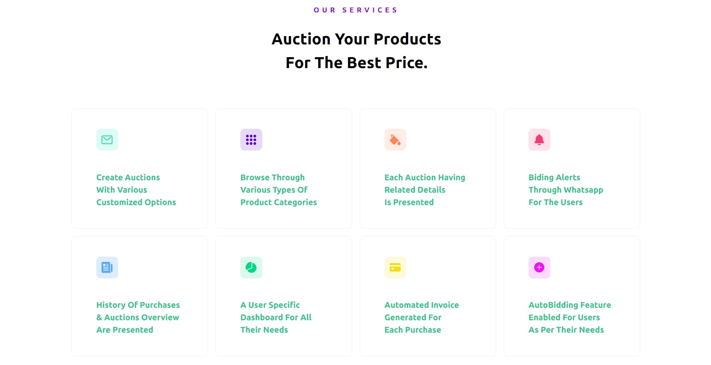

<h4>Product Gallery</h4>

<h4>Categories</h4>
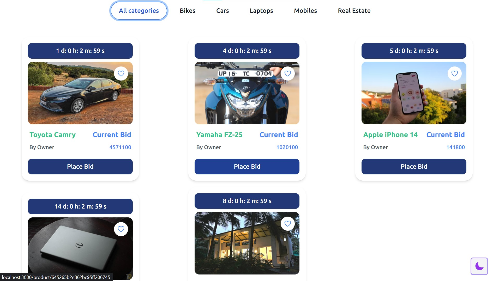

<h2>Auction Page</h2>

<h4>Auction Page Hero</h4>
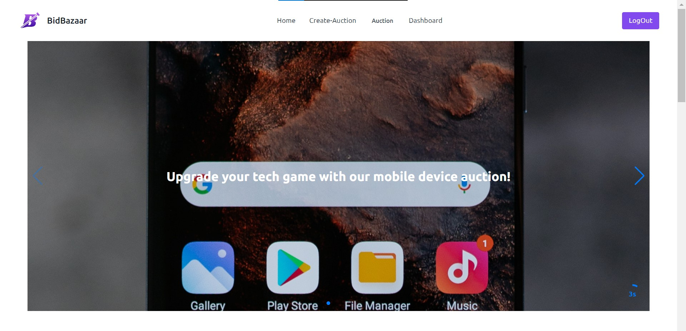

<h4>Latest Products</h4>
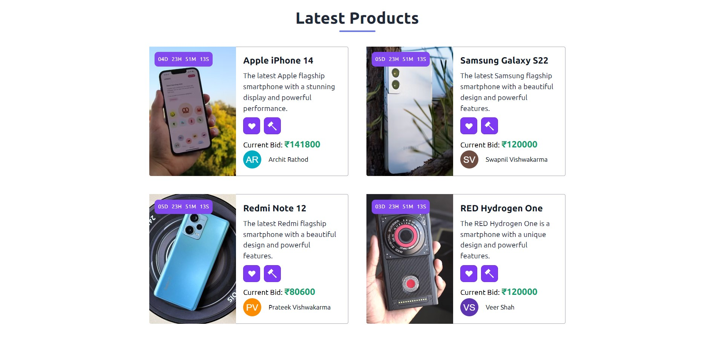

<h4>Filters</h4>
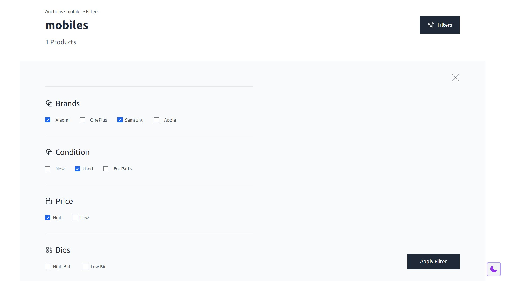

<h2>Product Bidding Page</h2>

<h4>Product Details</h4>
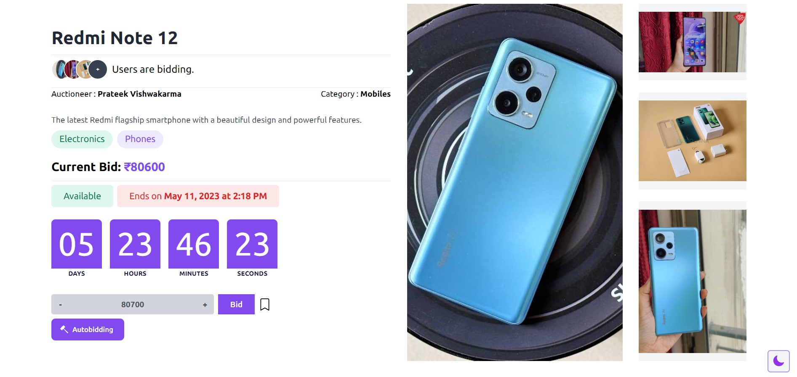

<h4>Bidding History and Specs</h4>

<h4>Live Chat</h4>
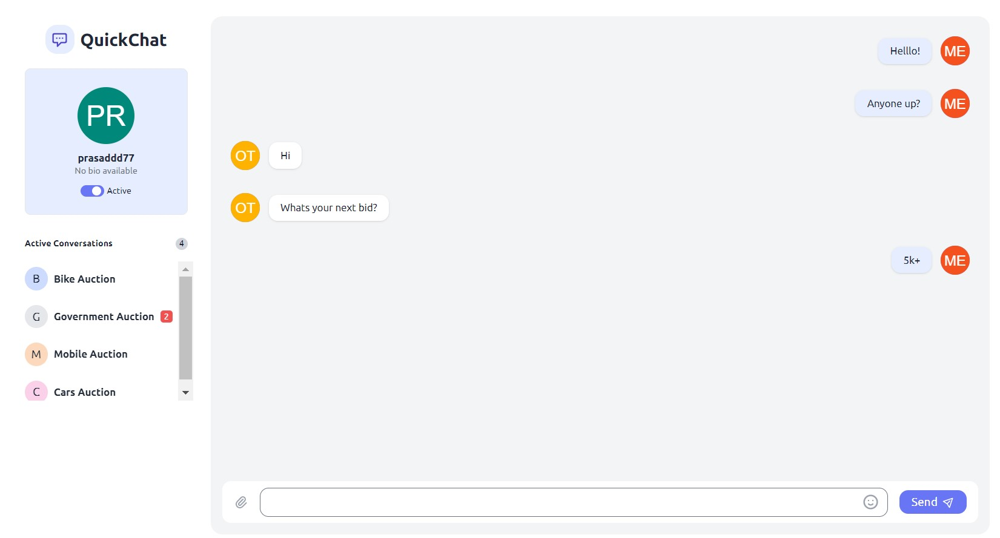

<h4>FAQs and Vendor Reviews</h4>
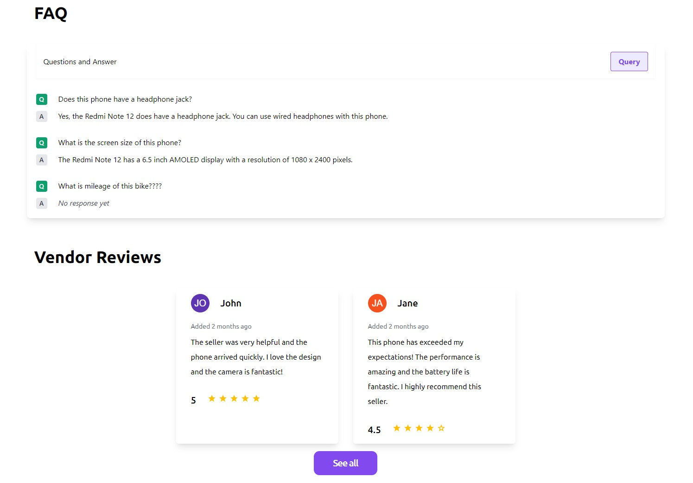

<h4>Reverse Bidding for Governemt Tenders</h4>
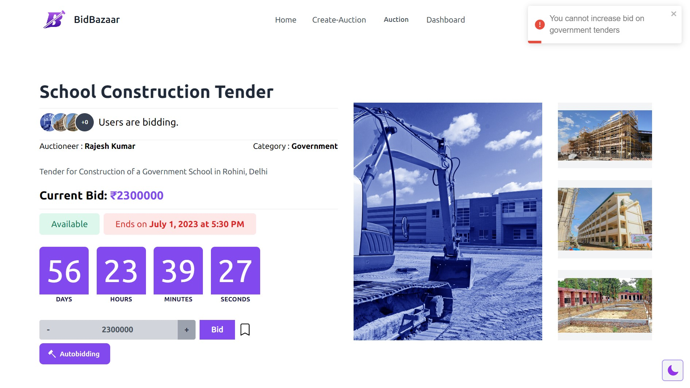

<h2>Create an Auction</h2>

<h4>Form 1</h4>
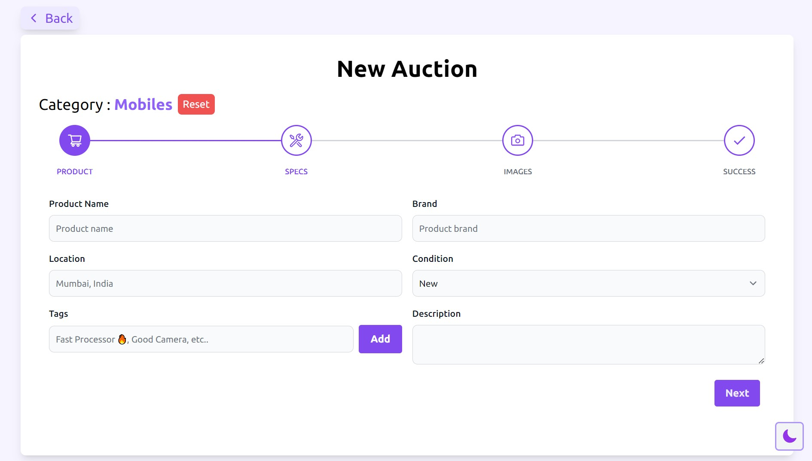

<h4>Form 2</h4>
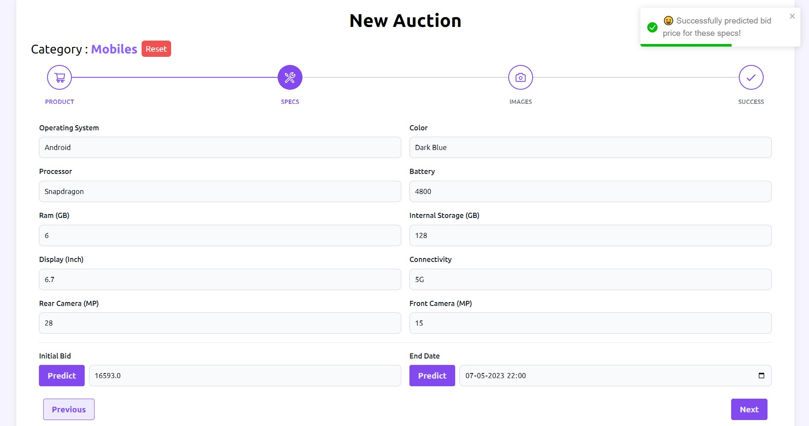

<h4>Form 3</h4>
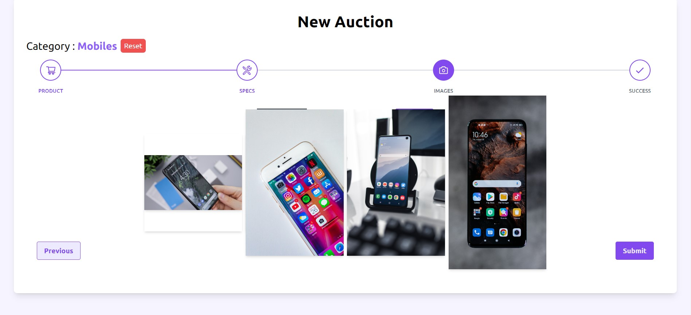

<h4>Form 4</h4>
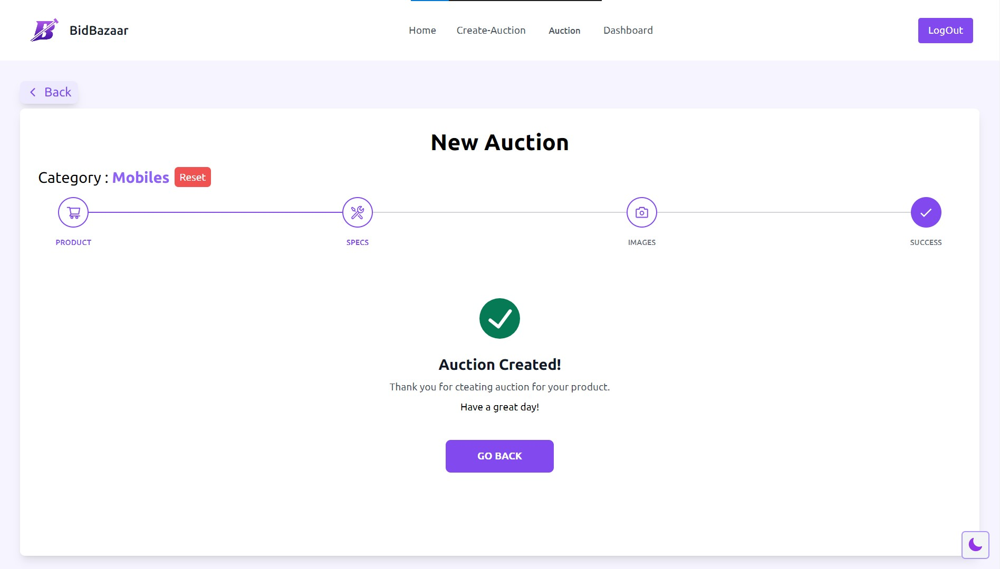

<h2>User History and Admin Pages</h2>

<h4>User History - Profile</h4>
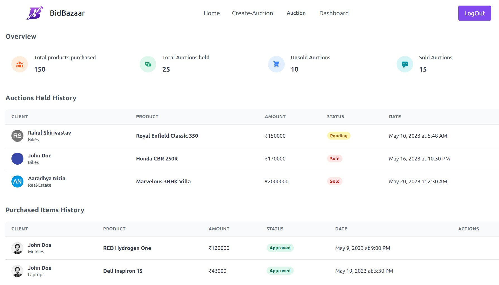

<h4>Admin</h4>
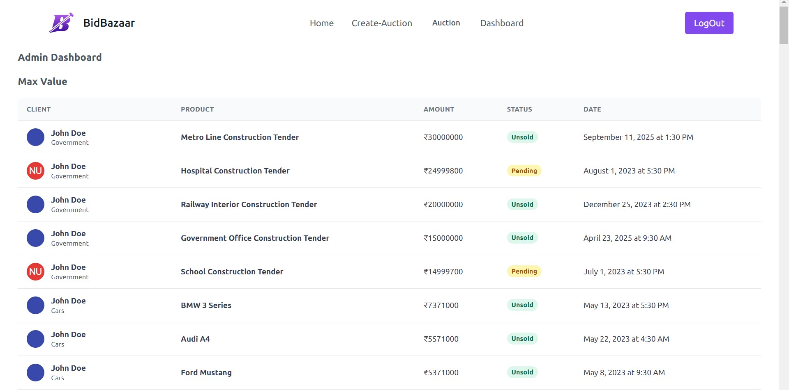

<h2>Login - Signup Pages</h2>

<h4>Login</h4>
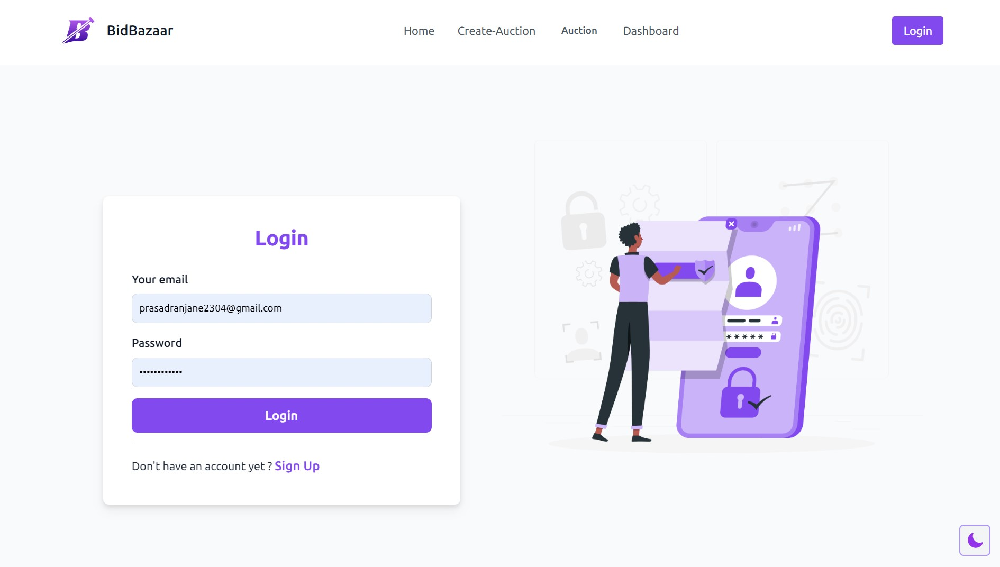

<h4>Signup</h4>

### How to run the application:

1.  Clone the repository from GitHub. `git clone `
2.  Install the required dependencies using npm or yarn. `npm install`
3.  Set up a Cloudinary account and configure the Cloudinary API key and secret in the .env file.
4.  Start the backend server you are using npm or yarn.
5.  Start the frontend server using `npm run dev` in the client folder.
6.  Access the application in your web browser at [http://localhost:3000](http://localhost:3000/).

Thank you for using Bid-Bazaar. We hope you enjoy using our platform for all your auction needs!

### Created By EPICS Group - 114

- Lawanya Veer
- Saksham Shandilya
- Mohit Deshmukh
- Anshul Sarathe
- Gyan Prakarsh